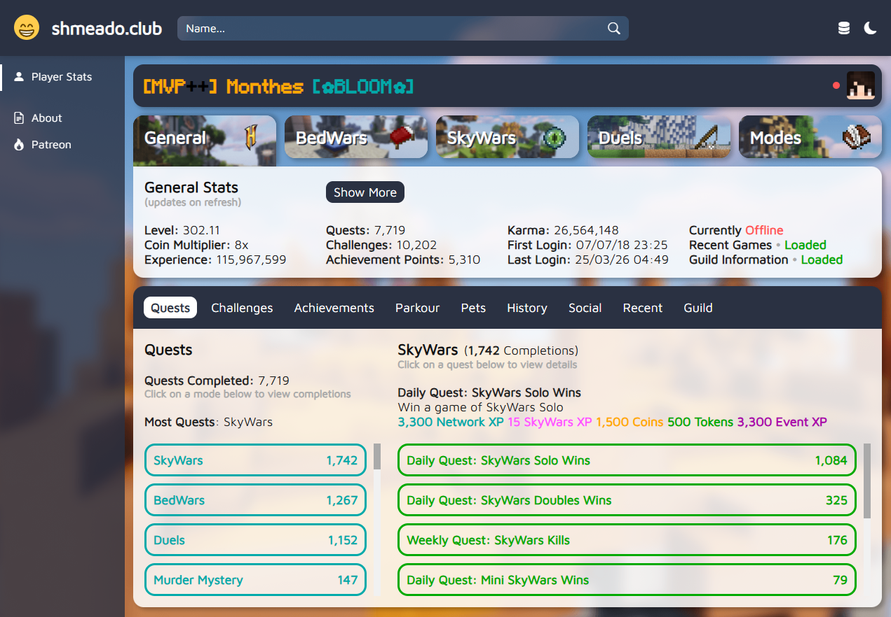
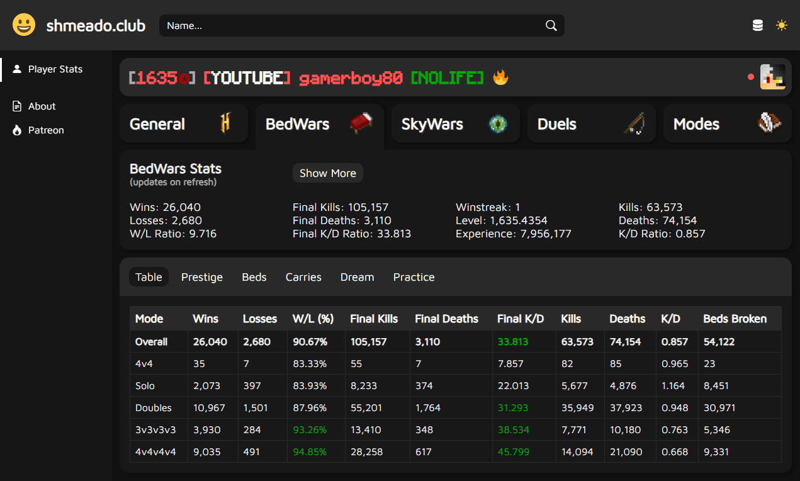
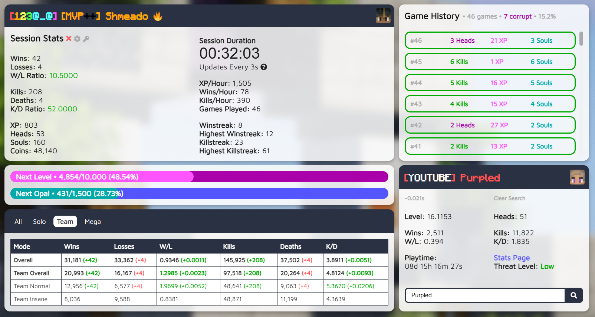
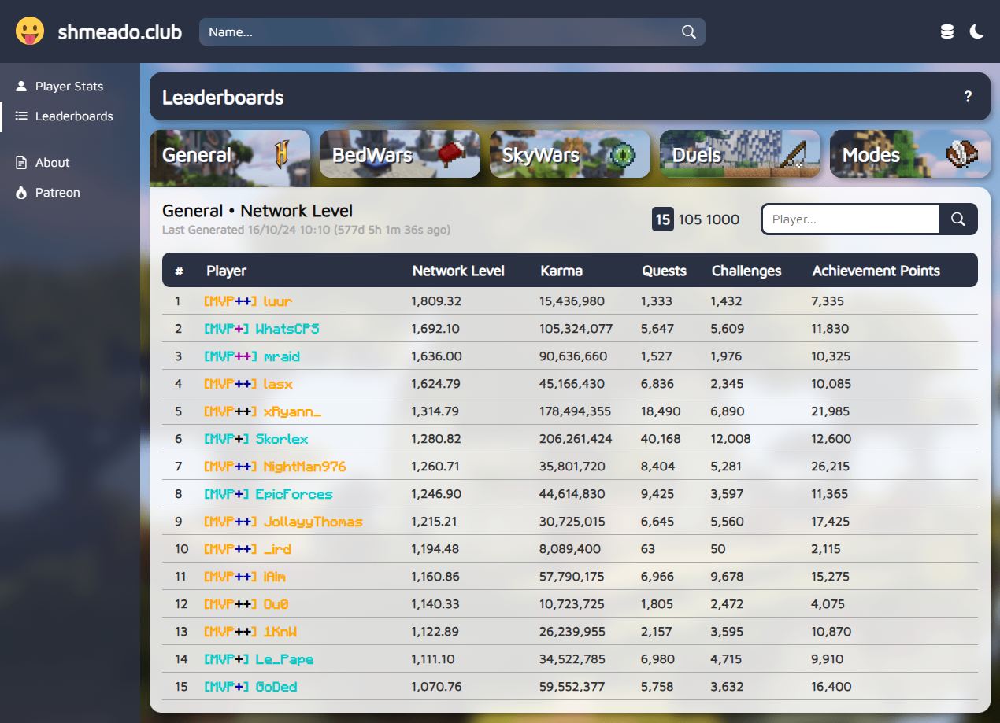

# Shmeado
[Shmeado](https://www.shmeado.club) is an advanced player statistics platform for the Hypixel Network, serving users globally since its launch to production in 2020.

The goal of this project is to provide a consolidated stats solution for Hypixel players, while excelling in both appearance and functionality.

This has been achieved through meticulous design, userbase engagement, and attention to detail throughout.

## Technology Stack

- Frontend: HTML/CSS/JavaScript/Bootstrap
- Backend: Django/WhiteNoise
- Database: MySQL
- APIs: Hypixel Public API v2
- Server: Apache

# Features
## 🧑 Stats
Core Hypixel player stats, providing beautifully-presented and detailed information. Follows an intuitive structure, offering quick and direct navigation across all Hypixel modes. A range of visual aids including tables, graphics, and interactive lists elements are used throughout.

**The Quests tab from the Player Stats page (Light Theme):**

 

**The BedWars Table tab from the Player Stats page (Dark Theme):**

## ⏰ Live Track
The first of its kind, Live Track was introduced in 2020 as a web-based session tracker, providing live updates and statistics for users in real time as they played. Unlike existing client-based trackers, this was the first web-based solution, ensuring compatibility with any game client. Live Track quickly grew in popularity as more game modes and features were added, including Game History, Anti-Rage, and Quick Search.

**An active Live Track session before its removal in 2024:**

## 📊 Leaderboards
In 2022, a new database infrastructure was created to serve a Leaderboards page, where users could view and search among the top 1,000 players for a variety of disciplines. At peak, 275 leaderboards were updated on a daily basis, each derived from a continually-updating database of over 120,000 Hypixel players. An additional webserver was deployed to handle leaderboard generation, communicating with the main webserver through an internal REST API. 

**The General Network Level leaderboard before its removal in 2024:**

## 🪦 Fate
Due to an unfortunate - but understandable - change to the [Hypixel API policy](https://developer.hypixel.net/policies/) in 2024, Live Track and Leaderboards both had to be removed from the site due to their use of automated API polling. However, the Player Stats portion of Shmeado remains intact, continuing to provide advanced player statistics for all Hypixel modes.

# Installation
## Prerequisites
1. Python 3.12+ (required for Django 6.0)

## Steps
1. Clone this repository
2. Create a virtual environment using `python -m venv <path>`
3. Install dependencies using `pip install -r requirements.txt`
4. Rename `.envsample` to `.env` and populate your credentials
5. Prepare the database using `python manage.py migrate`
6. Run the server using `python manage.py runserver`

# License

This project is licensed under the Zlib License. See [LICENSE.md](LICENSE.md) for details.